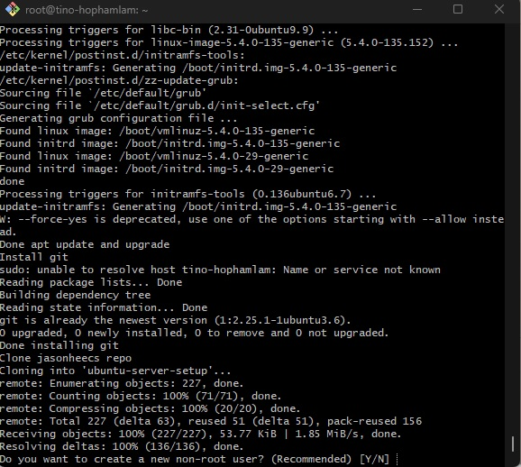
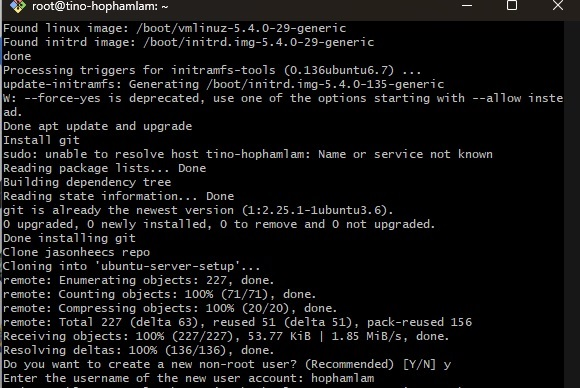
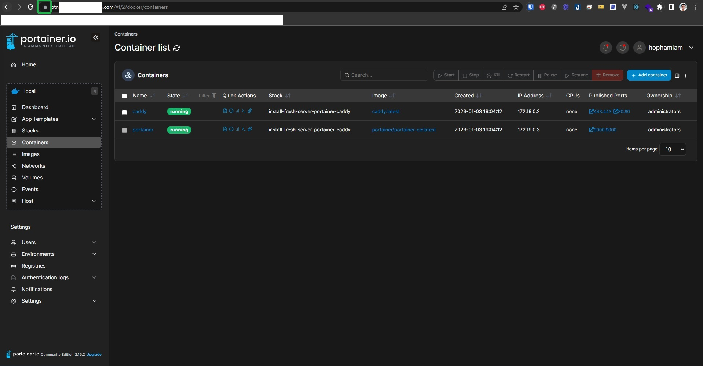

- [This script will install:](#this-script-will-install)
- [Initial new fresh server using jasonheecs repo](#initial-new-fresh-server-using-jasonheecs-repo)
  - [Recommendation](#recommendation)
  - [Getting Started](#getting-started)
  - [Next, the script will install Docker and Docker-compose](#next-the-script-will-install-docker-and-docker-compose)
  - [Check if everything is good](#check-if-everything-is-good)
- [Install Portainer CE \& Caddy-server \& Wireguard Server](#install-portainer-ce--caddy-server--wireguard-server)
  - [Before you go](#before-you-go)
  - [1 script to Install Portainer CE \& Caddy-server \& Wireguard Server](#1-script-to-install-portainer-ce--caddy-server--wireguard-server)
  - [Modify `Caddyfile`](#modify-caddyfile)
  - [In case you need to kill and remove all container](#in-case-you-need-to-kill-and-remove-all-container)
  - [In case you need to install Portainer Agent](#in-case-you-need-to-install-portainer-agent)

# This script will install:

- Initial new fresh server using [jasonheecs repo](https://github.com/jasonheecs/ubuntu-server-setup) (a new non-root user, turn on SSH-key login, disable root login)
- [Docker](https://www.digitalocean.com/community/tutorials/how-to-install-and-use-docker-on-ubuntu-20-04) and [Docker-compose](https://www.digitalocean.com/community/tutorials/how-to-install-and-use-docker-compose-on-ubuntu-20-04)
- [Portainer CE](https://docs.portainer.io/start/install-ce)
- [Caddy-server](https://caddyserver.com/)
- A wireguard server with fancy UI using [WeeJeWel repo](https://github.com/WeeJeWel/wg-easy)

# Initial new fresh server using [jasonheecs repo](https://github.com/jasonheecs/ubuntu-server-setup)

## Recommendation

- Recommended linux distro: `ubuntu 20.04` (tested)

- `id_rsa.pub` - ssh-key in your local pc (here is `id_rsa.pub`) - copy and paste down the your id_rsa.pub somewhere or even here

```bash
## at your local pc
ssh-keygen -t rsa
cat ~/.ssh/id_rsa.pub ## !!IMPORTANT print PC public key OUT
ls -al ~/.ssh ## to organize keys -> check key
nano ~/.ssh/known_hosts ## In case you re-install server & remove all old ssh-key from the rebuilt server
```

- `root-password` of your server - from your provider

## Getting Started

1 script to go (and some prompt input 😂)

```bash
wget https://raw.githubusercontent.com/hophamlam/initial-server-hophamlam/main/initial-server-script.sh && bash ./initial-server-script.sh
```

It will do apt update and upgrade, install git, clone jasonheecs repo (Install new non-root user for a fresh server with ssh-key log in and disable root). It will ask you:

**Do you want to create a new non-root user (Recommended)**



```
Y
```

**Enter the username of the new user account:**



`your-account` (not your-account, your real account)

**Full name, room number, work phone, home phone, other,...**

Just `enter` for all default anwser

**Paste in the public SSH key for the new user**

This is the important one, if pass the wrong key, you have to rebuild the server and re-do all the task again


Paste the `id_rsa.pub` we have prepared before

**Enter the timezone for the server (Default is 'Asia/Singapore')**


`your-server-timezone`

mine is

```
Asia/Ho_Chi_Minh
```

Check [List of tz database time zones](https://en.wikipedia.org/wiki/List_of_tz_database_time_zones)

## Next, the script will install Docker and Docker-compose

After getting it all done, we need to check if the script run well

## Check if everything is good

**SSH-key login:**
Open a new terminal Git Bash, try:

```bash
ssh your-remote-server-ip
```

or

```bash
ssh your-account@your-remote-server-ip
```

If you can log in without input password, you good and **from now you should exit root user ssh session and using** `ssh user@your-server`

**Docker and Docker-Compose**


```bash
docker --version && docker-compose --version
```

# Install [Portainer CE](https://docs.portainer.io/start/install-ce) & [Caddy-server](https://caddyserver.com/) & [Wireguard Server](https://github.com/WeeJeWel/wg-easy)

## Before you go

Create a Caddyfile & Portainer data

```bash
sudo docker volume create --name=caddy_data # Create caddy data
sudo mkdir ~/portainer-caddy-wg
sudo mkdir ~/portainer-caddy-wg/caddy
sudo mkdir ~/portainer-caddy-wg/portainer
sudo nano ~/portainer-caddy-wg/caddy/Caddyfile
```

Caddyfile example:

```bash
portainer.your-domain.com {
reverse_proxy portainer:9000 # Reverse proxy to Portainer container example
}
```

## 1 script to Install [Portainer CE](https://docs.portainer.io/start/install-ce) & [Caddy-server](https://caddyserver.com/) & [Wireguard Server](https://github.com/WeeJeWel/wg-easy)

Download docker-compose file and Edit Wireguard server password

```bash
sudo wget https://raw.githubusercontent.com/hophamlam/initial-server-hophamlam/main/docker-compose.yml -P ~/portainer-caddy-wg/ && sudo nano ~/portainer-caddy-wg/docker-compose.yml
```


**Now we go**

```bash
docker-compose -f ~/portainer-caddy-wg/docker-compose.yml up -d
```

## Modify `Caddyfile`

Whenever you want to update new record in Caddyfile:

```bash
nano ~/portainer-caddy-wg/caddy/Caddyfile
```

```bash
## example Caddyfile
portainer.your-domain.com {
reverse_proxy portainer:9000 ## Reverse proxy to Portainer container example
}
wg.your-domain.com {
    reverse_proxy wg-easy:51821 ## Update new domain for wireguard-server-webui
}
```

`⚠️IMPORTANT:`

- Join the container/app with caddy container network
- Point domain to host
- Ping domain to test
- Restart caddy container by log in to Portainer at `http://your-server-ip:9000` and restart Caddy container

**Or**

```bash
sudo docker restart caddy
```




## In case you need to kill and remove all container

```bash
sudo docker kill portainer
sudo docker kill caddy
sudo docker rm porainter
sudo docker rm caddy
sudo docker ps -a
#check if nothing display is good
```

## In case you need to install [Portainer Agent](https://docs.portainer.io/start/agent/docker/linux)

```bash
docker run -d -p 9001:9001 --name portainer_agent --restart=always -v /var/run/docker.sock:/var/run/docker.sock -v /var/lib/docker/volumes:/var/lib/docker/volumes portainer/agent:latest
```
