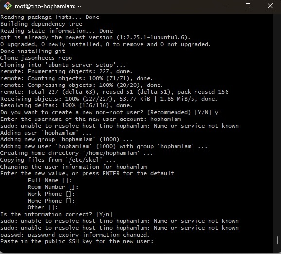
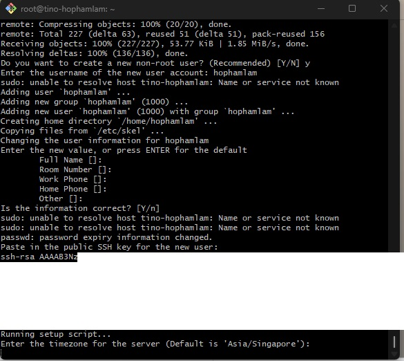
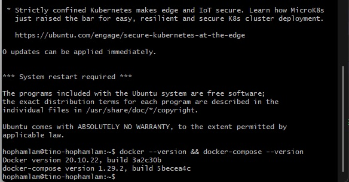

# This script will install

- [A new non-root user, turn on SSH-key login, disable root login](#install-new-non-root-user-for-a-fresh-server-with-ssh-key-log-in-and-disable-root)
- [Docker and Docker-compose](#docker-and-docker-compose)

# Before begin, prepare:

Recommended linux distro: `ubuntu 20.04` (tested)

`id_rsa.pub` - ssh-key in your local pc (here is id_rsa.pub) - copy and paste down the your id_rsa.pub somewhere or even here

```bash
## at your local pc
ssh-keygen -t rsa
cat ~/.ssh/id_rsa.pub ## !!IMPORTANT print PC public key OUT
ls -al ~/.ssh ## to organize keys -> check key
nano ~/.ssh/known_hosts ## In case you re-install server & remove all old ssh-key from the rebuilt server
```

`root-password` of your server - from your provider

# Getting Started

```bash
wget https://raw.githubusercontent.com/hophamlam/portainer-caddy-new-server/main/install-fresh-server.sh
sh install-fresh-server.sh && bash ./install-fresh-server.sh
```

## Install new non-root user for a fresh server with ssh-key log in and disable root

It will do apt update and upgrade, install git, clone jasonheecs repo. It will ask you:

### Do you want to create a new non-root user (Recommended)


`Y`

### Enter the username of the new user account:


`your-account` (not your-account, your real account)

### Full name, room number, work phone, home phone, other,...

Just `enter` for default anwser

### Paste in the public SSH key for the new user

This is the important one, if pass the wrong key, you have to rebuild the server and re-do all the task again



Paste the `id_rsa.pub` we have prepared before

### Enter the timezone for the server (Default is 'Asia/Singapor')



`your-server-timezone` mine is Asia/Ho_Chi_Minh, visit [List of tz database time zones](https://en.wikipedia.org/wiki/List_of_tz_database_time_zones)

## Next, the script will install Docker and Docker-compose

After getting it all done, we need to check if the script run well

# Double Check

## SSH-key login

Open a new terminal Git Bash

Try

```bash
ssh your-remote-server-ip
```

or

```bash
ssh your-account@your-remote-server-ip
```

If you can log in without input password, you good

## Docker and Docker-Compose



```bash
docker --version && docker-compose --version
```
