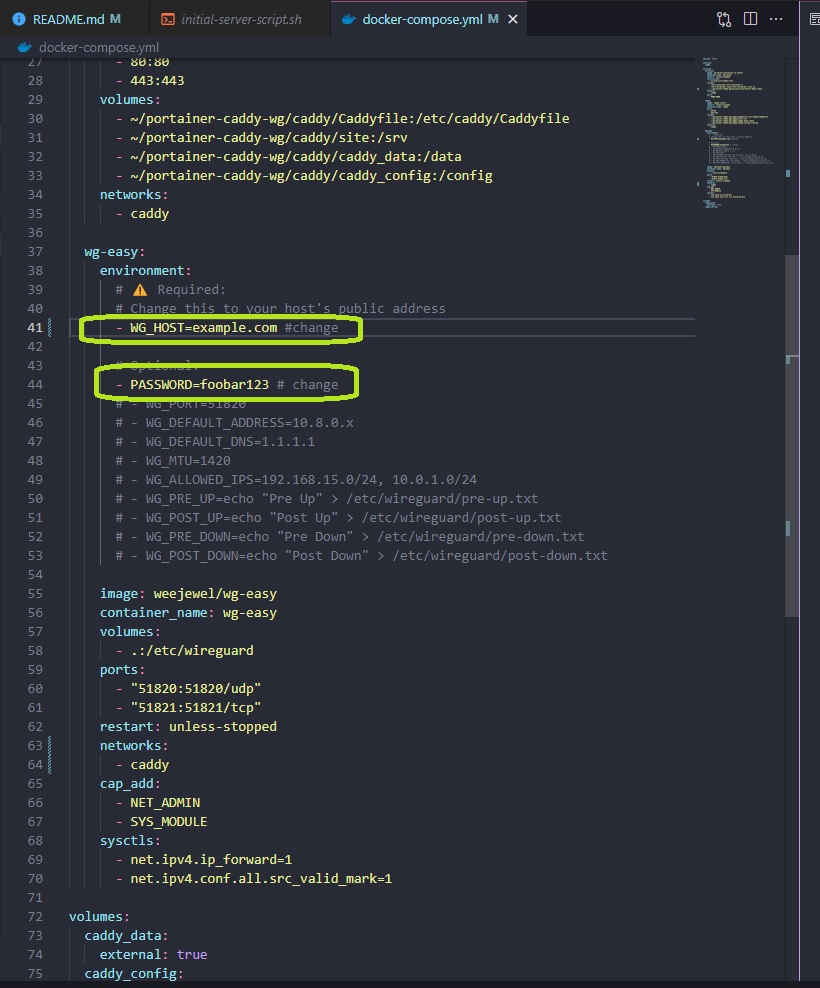
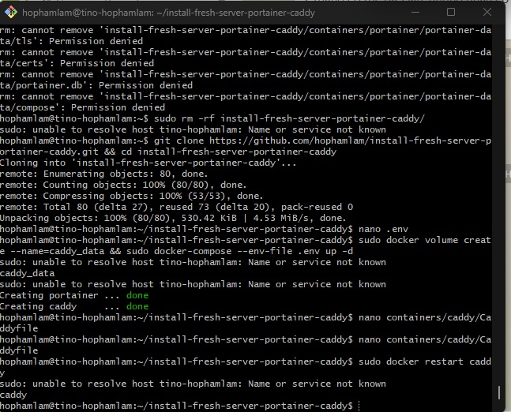

**==============================OLD_README========================**

# Install Docker and Docker-compose

Log in as user you just created `ssh user@your-server` from local or `su - yourusername` from root access

```bash
## Install Docker & Docker-compose
sudo apt update && sudo apt install apt-transport-https ca-certificates curl software-properties-common -y && curl -fsSL https://download.docker.com/linux/ubuntu/gpg | sudo apt-key add - && sudo add-apt-repository "deb [arch=amd64] https://download.docker.com/linux/ubuntu focal stable" && apt-cache policy docker-ce && sudo apt install docker-ce -y && sudo curl -L "https://github.com/docker/compose/releases/download/1.29.2/docker-compose-$(uname -s)-$(uname -m)" -o /usr/local/bin/docker-compose && sudo chmod +x /usr/local/bin/docker-compose
```

```bash
#Check if docker & docker-compose is installed
sudo docker --version && docker-compose --version
```


# Install [Portainer CE](https://docs.portainer.io/start/install-ce) & [Caddy-server](https://caddyserver.com/) & [Wireguard Server](https://github.com/WeeJeWel/wg-easy)

# This script will install

- [Portainer CE](https://docs.portainer.io/start/install-ce)
- [Caddy-server](https://caddyserver.com/)
- [Wireguard Server](https://github.com/WeeJeWel/wg-easy)

## Before you go

Log in as user you just created `ssh user@your-server`

Create a Caddyfile & Portainer data

```bash
sudo docker volume create --name=caddy_data # Create caddy data
sudo mkdir ~/initial-server
sudo mkdir ~/initial-server/caddy
sudo mkdir ~/initial-server/portainer
sudo mkdir ~/initial-server/wg
sudo nano ~/initial-server/caddy/Caddyfile
```

Caddyfile example:

```bash
portainer.your-domain.com {
  reverse_proxy portainer:9000 # Reverse proxy to Portainer container example
}
```

## 1 script to Install [Portainer CE](https://docs.portainer.io/start/install-ce) & [Caddy-server](https://caddyserver.com/) & [Wireguard Server](https://github.com/WeeJeWel/wg-easy)

Download docker-compose file and Edit Wireguard server password

```bash
sudo wget https://raw.githubusercontent.com/hophamlam/initial-server/main/docker-compose.yml -P ~/portainer-caddy-wg/ && sudo nano ~/portainer-caddy-wg/docker-compose.yml
```



**Now we go**

```bash
sudo docker compose -f ~/initial-server/docker-compose.yml up -d
```

## Modify `Caddyfile`

Whenever you want to update new record in Caddyfile:

```bash
sudo nano ~/initial-server/caddy/Caddyfile
```

```bash
## example Caddyfile
portainer.your-domain.com {
reverse_proxy portainer:9000 ## Reverse proxy to Portainer container example
}
wg.your-domain.com {
    reverse_proxy wg-easy:51821 ## Update new domain for wireguard-server-webui
}
```

`⚠️IMPORTANT:`

- Join the container/app with caddy container network
- Point domain to host
- Ping domain to test
- Restart caddy container by log in to Portainer at `http://your-server-ip:9000` and restart Caddy container

**Or**

```bash
sudo docker restart caddy
```




## In case you need to kill and remove all container

```bash
sudo docker kill portainer
sudo docker kill caddy
sudo docker rm porainter
sudo docker rm caddy
sudo docker ps -a
#check if nothing display is good
```

## In case you need to install [Portainer Agent](https://docs.portainer.io/start/agent/docker/linux)

```bash
sudo docker run -d -p 9001:9001 --name portainer_agent --restart=always -v /var/run/docker.sock:/var/run/docker.sock -v /var/lib/docker/volumes:/var/lib/docker/volumes portainer/agent:latest
```

## Update portainer, caddy, wg stack

```bash
sudo docker compose -f ~/initial-server/docker-compose.yml down && sudo docker compose -f ~/initial-server/docker-compose.yml up -d
```
